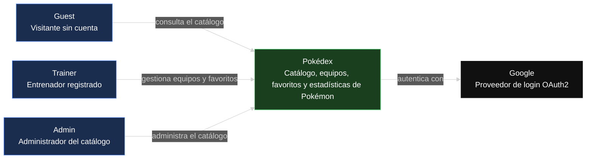
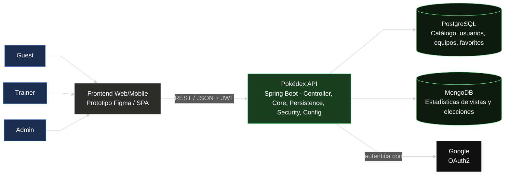

# Pokédex — Frontend

Prototipo funcional de la interfaz de la Pokédex: catálogo de Pokémon, equipos, favoritos y
estadísticas, consumiendo la [Pokédex API](#) <!-- reemplazar con el link al repo de backend -->.

>  **Prototipo en Figma:** [enlace al prototipo](#) <!-- reemplazar con el link real de Figma -->

## Tabla de contenidos

1. [Descripción del proyecto](#descripción-del-proyecto)
2. [Manual de identidad](#manual-de-identidad)
3. [Diagramas](#diagramas)

## Descripción del proyecto

**Chimidex** es la interfaz de una Pokédex inspirada en las cartas del Pokémon Trading Card Game,
con un giro deportivo: cada Poké Ball se rediseña con las costuras de un balón de baloncesto, y
armar un equipo se siente como armar el roster de un equipo de básquet. Charizard es la mascota
de la marca. El estilo visual es retro-moderno — texturas y tipografía de cartucho/carta de los
90s sobre un layout limpio y actual.

La interfaz consume la [Pokédex API](#) <!-- link al repo de backend --> y cubre tres tipos de
usuario: **Guest** (visitante, solo puede explorar el catálogo), **Trainer** (entrenador
registrado, arma equipos y marca favoritos) y **Admin** (administra el catálogo de Pokémon).

Flujos principales del prototipo:

- **Explorar el catálogo** — cada Pokémon se muestra como una carta TCG (tipo, stats, número de
  serie), con filtros por tipo, región y generación.
- **Armar equipo** — selección tipo "draft" de hasta 6 Pokémon, con el balón-Poké Ball como acción
  principal para agregar/quitar.
- **Favoritos** — marcar Pokémon de interés desde cualquier vista del catálogo.
- **Estadísticas** — ranking de Pokémon más vistos y más elegidos en equipos, con estética de
  marcador deportivo.
- **Panel de administración** — CRUD del catálogo, exclusivo para el rol Admin.

## Manual de identidad

**Chimidex** — inspirada en las cartas del Pokémon Trading Card Game, con Charizard como mascota
y un cruce temático con baloncesto (las Poké Ball se rediseñan con costuras de balón). Estilo
general: **retro-moderno** — texturas y tipografía de cartucho/cartas de los 90s, aplicadas con
un layout limpio y actual.

### Mascota y logo

- **Mascota:** Charizard, en pose dinámica (a media "volcada" tipo mate de baloncesto).
- **Isotipo:** Poké Ball rediseñada con las costuras curvas de un balón de baloncesto en vez de
  la línea central clásica — mitad superior en naranja balón, mitad inferior en crema hueso.
- **Logotipo:** "CHIMIDEX" en bloque retro (ver tipografía de display), con una sombra ligera o
  textura de puntos (halftone) para sensación de impresión de cómic/carta antigua.

### Paleta de colores

| Color | Hex | Uso |
|---|---|---|
| Fuego Charizard | `#FF6B35` | Color primario — CTAs, acentos de marca |
| Ember profundo | `#D2401F` | Hover/estados activos, degradados con el primario |
| Naranja balón | `#E67E22` | Isotipo (Poké Ball-balón), iconografía deportiva |
| Crema carta | `#F5E6C8` | Fondo de cards estilo TCG, "papel" retro |
| Tinta | `#1A1A1A` | Texto, contornos tipo cómic, costuras del balón |
| Oro holo | `#E8B923` | Bordes de rareza/foil, badges destacados (favoritos, stats top) |
| Azul cancha | `#1B2A4A` | Contraste/dark mode, headers, texto secundario |

### Tipografía

Combinación retro para display + una sans legible para cuerpo de texto (los bloques de datos de
un Pokémon necesitan legibilidad real, no solo estética):

| Uso | Fuente sugerida | Notas |
|---|---|---|
| Logotipo / Display | **Bungee** | Bloque retro-poster, para "CHIMIDEX" y títulos grandes |
| Encabezados / Stats | **Rubik Mono One** | Look de marcador deportivo / cartucho de consola |
| Cuerpo de texto | **Work Sans** o **Inter** | Legible en descripciones, listas y formularios |

### Componentes base

- **Card de Pokémon (estilo TCG):** tarjeta con esquinas redondeadas, borde de color por tipo
  (fuego = naranja, agua = azul, etc.), fondo crema, ilustración central, franja de stats en la
  parte inferior imitando el layout de HP/ataques de una carta real, y el número de Pokédex como
  "número de serie" en la esquina.
- **Botón / ícono primario:** usa el isotipo balón-Poké Ball como marcador visual en acciones
  clave (agregar a equipo, marcar favorito).
- **Fondo de tablero:** textura sutil de cancha de baloncesto (líneas de madera + círculo central)
  como fondo de las vistas de listado/dashboard, muy tenue para no competir con el contenido.
- **Badges de tipo:** chips redondeados con el color de cada tipo, mismo estilo que las cartas TCG
  reales (Fuego, Agua, Planta, Eléctrico, etc.).

## Diagramas

### Diagrama de contexto (C4 — Nivel 1)

Muestra el sistema como caja negra, sus actores y la integración externa con Google.

### Diagrama de componentes general (C4 — Nivel 2)

Muestra las piezas internas del sistema: Frontend, Backend (API monolítica por capas) y las
bases de datos.

