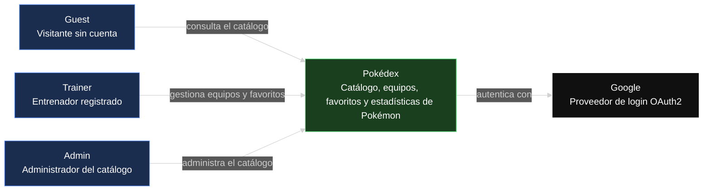
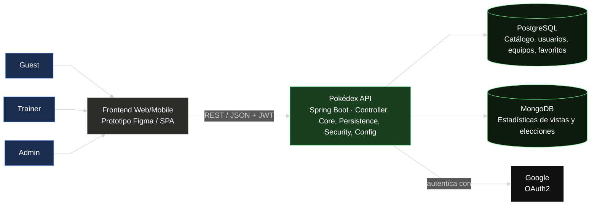

# Pokédex — Frontend

Prototipo funcional de la interfaz de la Pokédex: catálogo de Pokémon, equipos, favoritos y
estadísticas, consumiendo la [https://github.com/heverthisday/DOSW-2026-POKEDEX-BackEnd-HeverBarrera.git](#) <!-- reemplazar con el link al repo de backend -->.

>  **Prototipo :** [https://github.com/heverthisday/DOSW-2026-POKEDEX-Fronted-HeverBarrera/blob/main/prototype/index.html](#) <!-- reemplazar con el link real de Figma -->

## Tabla de contenidos

1. [Descripción del proyecto](#descripción-del-proyecto)
2. [Manual de identidad](#manual-de-identidad)
3. [Diagramas](#diagramas)

## Descripción del proyecto

**Chimidex** es la interfaz de una Pokédex inspirada en las cartas del Pokémon Trading Card Game,
con un giro deportivo: cada Poké Ball se rediseña con las costuras de un balón de baloncesto, y
armar un equipo se siente como armar el roster de un equipo de básquet. Charizard es la mascota
de la marca. El estilo visual es retro-moderno — texturas y tipografía de cartucho/carta de los
90s sobre un layout limpio y actual.

La interfaz consume la [Pokédex API](#) <!-- link al repo de backend --> y cubre tres tipos de
usuario: **Guest** (visitante, solo puede explorar el catálogo), **Trainer** (entrenador
registrado, arma equipos y marca favoritos) y **Admin** (administra el catálogo de Pokémon).

Flujos principales del prototipo:

- **Explorar el catálogo** — cada Pokémon se muestra como una carta TCG (tipo, stats, número de
  serie), con filtros por tipo, región y generación.
- **Armar equipo** — selección tipo "draft" de hasta 6 Pokémon, con el balón-Poké Ball como acción
  principal para agregar/quitar.
- **Favoritos** — marcar Pokémon de interés desde cualquier vista del catálogo.
- **Estadísticas** — ranking de Pokémon más vistos y más elegidos en equipos, con estética de
  marcador deportivo.
- **Login** — controla el acceso; una vez autenticado como Admin, se habilita el panel de
  administración.
- **Panel de administración** — CRUD del catálogo en formato tabla, exclusivo para el rol Admin
  y accesible solo después de iniciar sesión.

## Manual de identidad

**Chimidex** — inspirada en las cartas del Pokémon Trading Card Game, con Charizard como mascota
y un cruce temático con baloncesto (las Poké Ball se rediseñan con costuras de balón). Estilo
general: **retro-moderno** — texturas y tipografía de cartucho/cartas de los 90s, aplicadas con
un layout limpio y actual.

### Mascota y logo

- **Mascota:** Charizard, en pose dinámica (a media "volcada" tipo mate de baloncesto).
- **Isotipo:** Poké Ball rediseñada con las costuras curvas de un balón de baloncesto en vez de
  la línea central clásica — mitad superior en naranja balón, mitad inferior en crema hueso.
  Se usa en el header, en el botón de "marcar favorito" y en el botón de "agregar a equipo".
- **Logotipo:** "CHIMIDEX" en Bungee, todo mayúsculas, en el header de cada pantalla.

### Paleta de colores

| Color | Hex | Uso |
|---|---|---|
| Fuego Charizard | `#FF6B35` | Color primario — CTAs, acentos de marca |
| Ember profundo | `#D2401F` | Hover/estados activos, degradados con el primario |
| Naranja balón | `#E67E22` | Isotipo (Poké Ball-balón), iconografía deportiva |
| Crema carta | `#F5E6C8` | Fondo general de la app, tipo "papel" de carta TCG |
| Crema carta claro | `#FBE3C6` / `#EFDDB6` | Variantes de fondo para filas/tarjetas secundarias |
| Tinta | `#1A1A1A` | Texto, contornos tipo cómic, header, costuras del balón |
| Oro holo | `#E8B923` | Contador de equipo, badges de rareza/destacados |
| Azul cancha | `#1B2A4A` / `#20304f` | Fondo del área de ilustración en la vista de detalle |

**Colores de tipo:** cada tipo de Pokémon (Fuego, Agua, Planta, Eléctrico, etc.) tiene su propio
color de acento para bordes de card y badges — ej. Agua usa `#2E86C1`, Normal usa `#9A9885`. La
lista completa vive en `data.js` (`TYPE_COLORS`).

### Tipografía

| Uso | Fuente | Notas |
|---|---|---|
| Logotipo / Display | **Bungee** | "CHIMIDEX" y títulos grandes (ej. nombre del Pokémon en detalle) |
| Encabezados / Stats / Nav | **Rubik Mono One** | Look de marcador deportivo — nav, contador de equipo, barras de stats, tabla de admin |
| Cuerpo de texto | **Work Sans** | Descripciones, formularios, listas de ataques |

### Componentes implementados

- **Card de Pokémon (catálogo):** borde de color por tipo, fondo crema, silueta placeholder
  (marcada explícitamente como tal, sin arte real), badges de tipo, número de Pokédex.
- **Vista de detalle:** card ampliada con barras de stats, lista de ataques, descripción, y
  botones de favorito/equipo con el isotipo balón-Poké Ball.
- **Slots de equipo:** hasta 6 espacios (llenos o vacíos) con opción de quitar cada Pokémon
  directamente desde ahí; el contador "X/6" del header refleja el estado real en todo momento.
- **Ranking de stats:** listas numeradas tipo tabla de posiciones para "más vistos" y "más
  elegidos en equipos".
- **Panel de administración:** tabla con columnas (Nº, nombre, tipo, región, generación, stats,
  acciones), protegida detrás del login — solo visible para el rol Admin autenticado.
- **Login:** formulario simple, mismo estilo retro-moderno, controla el acceso a Admin.

### Pendiente de identidad visual

- Marca de agua de cancha de baloncesto (líneas de cancha + isotipo balón-Poké Ball en el
  círculo central) — diseñada pero aún no implementada en el prototipo.
- Definición final de cómo se ilustra cada Pokémon (actualmente silueta placeholder; ver nota
  de alcance más abajo).

## Diagramas

### Diagrama de contexto (C4 — Nivel 1)

Muestra el sistema como caja negra, sus actores y la integración externa con Google.

### Diagrama de componentes general (C4 — Nivel 2)

Muestra las piezas internas del sistema: Frontend, Backend (API monolítica por capas) y las
bases de datos.

