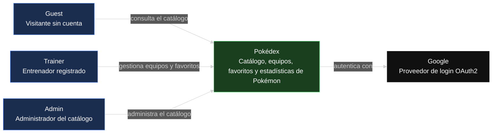
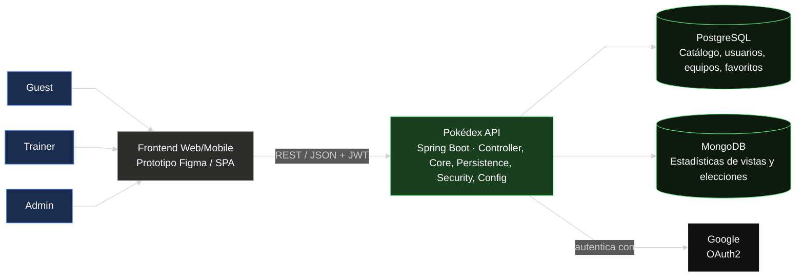

# Pokédex — Frontend

Prototipo funcional de la interfaz de la Pokédex: catálogo de Pokémon, equipos, favoritos y
estadísticas, consumiendo la [Pokédex API](https://github.com/heverthisday/DOSW-2026-POKEDEX-BackEnd-HeverBarrera.git).

>  **Prototipo :** [https://github.com/heverthisday/DOSW-2026-POKEDEX-Fronted-HeverBarrera/blob/main/prototype/index.html](#) <!-- reemplazar con el link real de Figma -->

## Tabla de contenidos

1. [Descripción del proyecto](#descripción-del-proyecto)
2. [Manual de identidad](#manual-de-identidad)
3. [Diagramas](#diagramas)

## Descripción del proyecto

**Chimidex** es la interfaz de una Pokédex inspirada en las cartas del Pokémon Trading Card Game,
con un giro deportivo: cada Poké Ball se rediseña con las costuras de un balón de baloncesto, y
armar un equipo se siente como armar el roster de un equipo de básquet. Charizard es la mascota
de la marca. El estilo visual es retro-moderno — texturas y tipografía de cartucho/carta de los
90s sobre un layout limpio y actual.

La interfaz consume la [Pokédex API](https://github.com/heverthisday/DOSW-2026-POKEDEX-BackEnd-HeverBarrera.git)
y cubre tres tipos de usuario: **Guest** (visitante, solo puede explorar el catálogo), **Trainer**
(entrenador registrado, arma equipos y marca favoritos) y **Admin** (administra el catálogo de
Pokémon).

> **Nota de alcance:** en el prototipo actual, el login es una demo — cualquier email y contraseña
> otorgan acceso de **Admin** (no hay distinción real Trainer/Admin todavía, ni conexión real al
> backend). Explorar el catálogo, marcar favoritos y armar equipos funciona sin iniciar sesión;
> el login solo habilita/deshabilita la pestaña **Admin** de la navegación. Esto es intencional
> para el prototipo — la integración real con `/v1/auth/login` de la API y el control de roles por
> JWT quedan para la conexión con el backend.

Flujos principales del prototipo:

- **Explorar el catálogo** — cada Pokémon se muestra como una carta TCG (tipo, stats, número de
  serie), con filtros por tipo, región y generación.
- **Armar equipo** — selección tipo "draft" de hasta 6 Pokémon, con el balón-Poké Ball como acción
  principal para agregar/quitar.
- **Favoritos** — marcar Pokémon de interés desde cualquier vista del catálogo.
- **Estadísticas** — ranking de Pokémon más vistos y más elegidos en equipos, con estética de 
  marcador deportivo.
- **Login** — controla el acceso; una vez autenticado como Admin, se habilita el panel de
  administración.
- **Panel de administración** — CRUD del catálogo en formato tabla, exclusivo para el rol Admin
  y accesible solo después de iniciar sesión.

## Manual de identidad

**Chimidex** — inspirada en las cartas del Pokémon Trading Card Game, con Charizard como mascota
y un cruce temático con baloncesto (las Poké Ball se rediseñan con costuras de balón). Estilo
general: **retro-moderno** — texturas y tipografía de cartucho/cartas de los 90s, aplicadas con
un layout limpio y actual.

### Mascota y logo

- **Mascota:** Charizard, ilustración PNG con transparencia a 475×475px (`cx-mascot-img`). Se
  muestra a 34×34px junto al logotipo en el header de cada pantalla (24×24px en mobile, `<600px`)
  y a 44×44px en la tarjeta de login, con `drop-shadow` para que resalte sobre el header oscuro.

  

  

- **Isotipo:** Poké Ball rediseñada con las costuras curvas de un balón de baloncesto en vez de
  la línea central clásica — mitad superior en naranja balón (`#E67E22`), mitad inferior en crema
  hueso (`#F5E6C8`), con el botón central de doble círculo típico de la Poké Ball. Está construido
  como SVG inline (`viewBox 0 0 100 100`, no como imagen), lo que permite reutilizarlo a cualquier

  
  

  tamaño en tres lugares distintos con el mismo trazo: el header (38px), la tarjeta de login (44px)
  y el botón de "marcar favorito" sobre cada carta (26px). Tiene dos animaciones propias: un "pop"
  de entrada al cargar la página (`cxLogoPop`, con *overshoot* de rotación) y un giro completo al
  hacer clic (`cxLogoSpin`).
- **Logotipo:** "CHIMIDEX" en **Bungee**, todo mayúsculas, junto al isotipo en el header de cada
  pantalla (26px de escritorio, 19px en mobile).
  

- **Divisor de marca:** debajo del header, una franja de 16px con degradado `#FF6B35 → #D2401F`
  recortada en zigzag (`clip-path` de picos triangulares) simula el borde dentado de una carta o
  de una llama estilizada — es el elemento que más conecta la identidad "fuego Charizard" con el
  layout, sin depender de una imagen.
  

**Diseño del catálogo de Pokémon:**

El catálogo presenta cada Pokémon como una carta al estilo Pokémon TCG (proporción real
2.5/3.5), organizadas en una grilla responsiva que se acomoda automáticamente según el ancho
de pantalla. Cada carta muestra el arte ilustrado real del Pokémon (obtenido dinámicamente de
la API pública TCGdex, con un estado de carga tipo *skeleton* y un placeholder de silueta si
no hay arte disponible), junto con su número de Pokédex, nombre, tipo(s), HP y
región/generación en el pie.

Sobre la carta se superponen dos acciones rápidas: marcar como favorito (con el isotipo
balón-Poké Ball) y agregar/quitar del equipo, sin necesidad de entrar al detalle. La vista
incluye filtros por tipo (chips de color), región y generación, más búsqueda y carga
incremental ("Cargar más"), manteniendo la estética retro-moderna de fondo crema y tipografía
Rubik Mono One para los datos numéricos.

 

### Paleta de colores

| Color | Hex | Uso |
|---|---|---|
| Fuego Charizard | `#FF6B35` | Color primario — CTAs, acentos de marca |
| Ember profundo | `#D2401F` | Hover/estados activos, degradados con el primario |
| Naranja balón | `#E67E22` | Isotipo (Poké Ball-balón), iconografía deportiva |
| Crema carta | `#F5E6C8` | Fondo general de la app, tipo "papel" de carta TCG |
| Crema carta claro | `#FBE3C6` / `#EFDDB6` | Variantes de fondo para filas/tarjetas secundarias |
| Tinta | `#1A1A1A` | Texto, contornos tipo cómic, header, costuras del balón |
| Oro holo | `#E8B923` | Contador de equipo, badges de rareza/destacados |
| Azul cancha | `#1B2A4A` / `#20304f` | Fondo del área de ilustración en la vista de detalle |

**Colores de tipo:** cada tipo de Pokémon (Fuego, Agua, Planta, Eléctrico, etc.) tiene su propio
color de acento para bordes de card y badges — ej. Agua usa `#2E86C1`, Normal usa `#9A9885`. La
lista completa vive en `data.js` (`TYPE_COLORS`).

### Tipografía

| Uso | Fuente | Notas |
|---|---|---|
| Logotipo / Display | **Bungee** | "CHIMIDEX" y títulos grandes (ej. nombre del Pokémon en detalle) |
| Encabezados / Stats / Nav | **Rubik Mono One** | Look de marcador deportivo — nav, contador de equipo, barras de stats, tabla de admin |
| Cuerpo de texto | **Work Sans** | Descripciones, formularios, listas de ataques |

### Formato de carta (componente `PokeCard`)

Cada Pokémon se renderiza como un componente reutilizable (`PokeCard`) que se usa en cinco lugares
distintos del prototipo: la grilla del catálogo, los slots de equipo, la vista de favoritos, el
comparador de estadísticas y las líneas evolutivas de la vista de detalle.

- **Proporción real de carta TCG:** `aspect-ratio: 2.5/3.5`, la misma proporción física de una
  carta del Pokémon Trading Card Game (63×88mm), con esquinas redondeadas de 16px y sombra
  proyectada — no es un cuadrado ni un rectángulo genérico de producto.
- **Arte de carta real, no una silueta fija:** al montarse, el componente consulta la API pública
  [TCGdex](https://api.tcgdex.net) por nombre de Pokémon y, si encuentra una carta, muestra su
  ilustración real (`webp`, con reintento en `png` si falla). Mientras carga, se ve un *skeleton*
  a rayas diagonales en tono "azul cancha" (`#1B2A4A`/`#20304f`); si TCGdex no tiene esa carta,
  cae a un placeholder con una silueta orgánica en el color primario del tipo y el texto "CARTA NO
  DISPONIBLE". Es decir: el prototipo sí muestra arte ilustrado real cuando está disponible, y el
  placeholder es solo el estado de error/carga, no el diseño final.
- **Overlays sobre la carta:** número de Pokédex arriba a la izquierda (`#001` estilo), botón de
  favorito arriba a la derecha (isotipo balón-Poké Ball por defecto, con una variante de corazón
  disponible vía prop), y un chip de "agregar/quitar del equipo" junto a él cuando corresponde.
  Al pasar el mouse, la carta escala levemente (`scale(1.035)`) y profundiza su sombra.
- **Pie de carta:** nombre en Rubik Mono One, HP en el color del tipo, región y generación en una
  segunda línea — reforzando la estética de "ficha de estadísticas deportivas" sobre el formato de
  carta coleccionable.

### Catálogo de Pokémon

El catálogo de muestra (`data.js` → `CHIMIDEX_POKEMON`) tiene **66 Pokémon** de las primeras
cuatro generaciones/regiones: **Kanto** (gen. 1), **Johto** (gen. 2), **Hoenn** (gen. 3) y
**Sinnoh** (gen. 4). Cada entrada trae número de Pokédex, tipo(s), stats base (HP/ATK/DEF/SPD),
hasta dos ataques con daño, y una descripción corta en español al estilo Pokédex clásica.

Incluye **7 líneas evolutivas completas** (Bulbasaur→Ivysaur→Venusaur, Charmander→Charmeleon→
Charizard, Squirtle→Wartortle→Blastoise, Machop→Machamp, Geodude→Golem, Abra→Alakazam, y las
8 evoluciones de Eevee), que alimentan el bloque "Línea evolutiva" de la vista de detalle: cada
etapa se muestra como una mini-`PokeCard` clicable, con flechas `→` entre etapas y ramificación
visual cuando hay más de una evolución posible (como Eevee).

Filtros disponibles en el catálogo: por tipo (chips con el color de cada tipo), por región y por
generación, más búsqueda y carga incremental ("Cargar más").

### Vista de detalle

Card ampliada (borde de 8px en el color del tipo primario, animación de entrada tipo "flip" en 3D
vía `perspective`/`rotateY`) con: imagen grande de la carta, badges de tipo, barras de stats
(HP/ATK/DEF/SPD con su valor numérico), lista de ataques con su daño, botones de favorito y de
equipo con contador "X/6", y el bloque de línea evolutiva cuando el Pokémon pertenece a una.

### Slots de equipo

Hasta 6 espacios (llenos o vacíos) con opción de reordenar (`←`/`→`) o quitar cada Pokémon
directamente desde ahí; el contador "X/6" del header y de la vista de equipo refleja el estado
real en todo momento. Los espacios vacíos abren un selector (`onOpenPicker`) para elegir Pokémon
por nombre y región.

### Estadísticas ("Marcador")

La vista de estadísticas está organizada en tres bloques, con estética de tablero deportivo
(fondo azul cancha `#1B2A4A`, tarjetas con borde grueso de 4px):

- **Comparador:** se eligen dos Pokémon de sendos selectores y se comparan lado a lado — cada uno
  con su `PokeCard` (borde naranja para A, azul para B) y, entre ambas, barras enfrentadas por
  stat (HP/ATK/DEF/SPD) que crecen desde el centro hacia cada lado, con el valor coloreado según
  cuál de los dos gana ese stat.
- **Rankings:** dos listas tipo tabla de posiciones — "Más vistos" (en oro `#E8B923`) y "Más
  elegidos en equipos" (en naranja `#FF6B35`) — pensadas para conectar con los endpoints
  `/v1/stats/most-viewed` y `/v1/stats/most-picked` de la API una vez integrada.
- **Gráficos:** barras horizontales animadas para "stat total promedio por tipo" (suma de
  HP+ATK+DEF+SPD ÷ 4, una barra por cada uno de los 18 tipos con su color oficial) y "Pokémon por
  región" (conteo de cuántos Pokémon del catálogo hay por región).

### Panel de administración

Tabla con columnas Nº, nombre, tipo, región, generación, HP, ATK, DEF, SPD y acciones
(Editar/Eliminar), accesible solo cuando `loggedIn` es verdadero (ver nota de alcance del login
más arriba). El formulario de alta/edición (modal) agrupa los campos en cuatro bloques — datos
básicos, tipo (chips seleccionables), estadísticas y ataque principal — siguiendo el mismo patrón
de "headers agrupados" que ya se usa en el backend para las peticiones de creación.

### Login

Formulario simple (email + contraseña) en la misma tarjeta retro-moderna que el resto del
prototipo, con el isotipo balón-Poké Ball como cabecera. Como se explica en la nota de alcance,
hoy es una simulación local: cualquier credencial marca `loggedIn = true` y habilita la pestaña
Admin — no valida contra la API todavía.

### Pendiente de identidad visual

- **Marca de agua de cancha de baloncesto** — diseñada pero aún no implementada en el prototipo
  (no hay ningún elemento de este tipo en `template.html` a día de hoy). Propuesta de
  implementación para cuando se agregue:
  - Capa `position: absolute; inset: 0; z-index: 0; opacity: .05–.08` detrás del contenido de
    cada vista (el contenido real ya vive en `position: relative; z-index: 1`, así que la marca de
    agua encajaría directamente detrás sin reestructurar el layout), con las líneas de una cancha
    de baloncesto: línea de medio campo, círculo central y arco de tiro libre, en trazo `#1A1A1A`
    delgado sobre el fondo crema.
  - En el centro del círculo, el isotipo balón-Poké Ball ya existente (reutilizando el mismo SVG
    del header) a mayor escala y muy baja opacidad, en vez de un elemento nuevo.
  - Aplicaría sobre todo al catálogo y al detalle, que son las vistas con más espacio vacío de
    fondo; en las vistas con tablas (Admin, Stats) conviene mantenerla más sutil para no competir
    con las barras y grillas de datos.
- **Definición final de cómo se ilustra cada Pokémon** — hoy depende de que TCGdex tenga una carta
  publicada para ese nombre; cuando no la tiene, se ve el placeholder de silueta (ver sección
  "Formato de carta" arriba). Falta decidir si el arte final vendrá de esta misma integración, de
  ilustraciones propias, o de un set de sprites servido por el propio backend.

## Diagramas

### Diagrama de contexto (C4 — Nivel 1)

Muestra el sistema como caja negra, sus actores y la integración externa con Google.

**Lectura del diagrama:** los tres actores (Guest, Trainer, Admin) interactúan con un único
sistema visto desde afuera — no distingue todavía frontend de backend, solo qué puede hacer cada
rol y que el sistema delega la autenticación en Google. En el prototipo actual, como se explica en
la nota de alcance, esta separación de roles es conceptual: el login demo solo activa/desactiva la
pestaña Admin, no hay una integración real con Google OAuth2 todavía (esa integración vive del
lado del backend, ver `OAuth2SuccessHandler` en el [repo de la API](https://github.com/heverthisday/DOSW-2026-POKEDEX-BackEnd-HeverBarrera.git)).

### Diagrama de componentes general (C4 — Nivel 2)

Muestra las piezas internas del sistema: Frontend, Backend (API monolítica por capas) y las
bases de datos.

**Lectura del diagrama:** el frontend (este repositorio) habla con el backend únicamente por
REST/JSON con JWT — nunca toca PostgreSQL ni MongoDB directamente, ni conoce sus modelos internos.
Hoy esa flecha `Front → Back` no está conectada de verdad: el prototipo usa el dataset local de
`data.js` (66 Pokémon) y estado en memoria para favoritos/equipos/estadísticas, precisamente para
poder validar la interfaz sin depender de que el backend esté desplegado. Conectar este diagrama
con la realidad es el siguiente paso natural: reemplazar `CHIMIDEX_POKEMON` por llamadas a
`GET /v1/pokemon`, el login demo por `POST /v1/auth/login`, y los rankings de "Marcador" por
`GET /v1/stats/most-viewed` y `GET /v1/stats/most-picked`.
