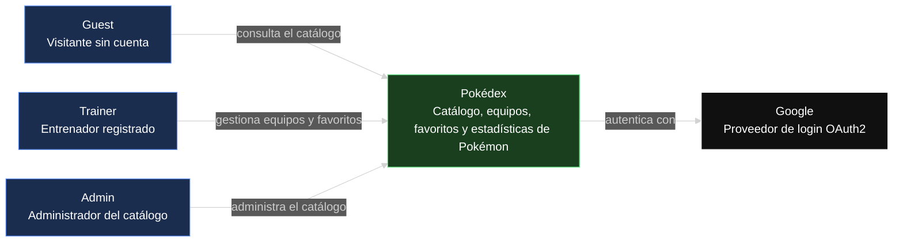
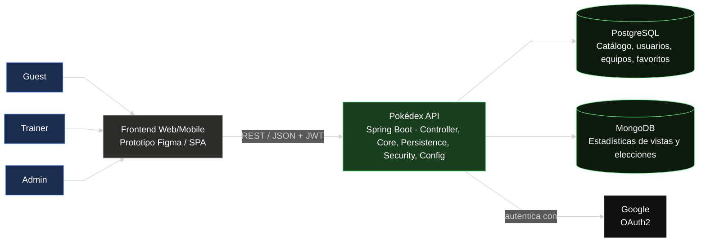

# Pokédex — Frontend

Prototipo funcional de la interfaz de la Pokédex: catálogo de Pokémon, equipos, favoritos y
estadísticas, consumiendo la [Pokédex API](#) <!-- reemplazar con el link al repo de backend -->.

> 🎨 **Prototipo en Figma:** [enlace al prototipo](#) <!-- reemplazar con el link real de Figma -->

## Tabla de contenidos

1. [Descripción del proyecto](#descripción-del-proyecto)
2. [Manual de identidad](#manual-de-identidad)
3. [Diagramas](#diagramas)

## Descripción del proyecto

<!-- Describir aquí en 1-2 párrafos: qué hace la interfaz, a quién va dirigida (Guest/Trainer/Admin),
     y qué flujos principales cubre el prototipo (ver catálogo, filtrar, armar equipos, marcar favoritos,
     ver estadísticas, panel de administración). -->

## Manual de identidad

<!-- Aquí va la guía de estilo visual del prototipo: paleta de colores, tipografía, logo,
     componentes reutilizables (botones, cards, inputs), tono de la marca. -->

### Paleta de colores

| Color | Hex | Uso |
|---|---|---|
| | | |

### Tipografía

<!-- Familia tipográfica principal y secundaria, tamaños de encabezados/cuerpo -->

### Componentes base

<!-- Botones, cards de Pokémon, badges de tipo, navegación, etc. -->

## Diagramas

### Diagrama de contexto (C4 — Nivel 1)

Muestra el sistema como caja negra, sus actores y la integración externa con Google.

### Diagrama de componentes general (C4 — Nivel 2)

Muestra las piezas internas del sistema: Frontend, Backend (API monolítica por capas) y las
bases de datos.

